# 标注裁定案例集

这一页给复核时对照。文字依据只有 `docs/v1-m1-labels.md` 的「复核判定标准」「标点和括号怎么标」「复核经验总结」三节。规则原文在那边，这里按情况配图。

图来自附件，文件名未改，放在 `docs/img/rulings/`。底稿清单是 `docs/img/rulings/index.md`。没有新渲染的图。

按键：`m` 合并，`d` 行间，`i` 行内，`e` 公式编号，`s` 拆分，`2` 正文，`4` 其他。确认按 Enter。

## 图例

红框是复核稿里的公式单元。合并过的，画合并后的整体。灰框是被裁成正文或其他的元素，说明里注明是哪一种。图是 2×，只保留裁剪区域。

五张疑点图（#18、#71、#78、#85、#165）的红框是旧范围。说明写成「旧标注，按新裁定应为…」。其余图的红框就是要标成的单元。

## 2026-09-30 新裁定

Wisdom 已批准下面五条，并已写进 `docs/v1-m1-labels.md` 的「2026-09-30 新裁定」和对应位置。练习集里 #165、#71、#78、#18、#85 的复核稿仍是旧标注。这一轮不改 `labels/`。改前需 Wisdom 过目，记在 `docs/owner-todo.md`。#176 的复核稿与下面这条一致，不改数据。

### 引用上标标正文

**看到什么。** 公式或图注末尾有一个小号上标数字，用来引用文献。式子本身是数学；上标不是式子的一部分。

**怎么标。** 上标按 `2` 标正文，不要并进公式。式子仍按它原来的行内或行间。

**为什么。** 判定：引用上标不是公式，按 `2`。2026-09-30 把「公式后面」和「图注末尾」两处写明，避免并进相邻公式。

**例子。** #165，`s41467-020-19530-1`，第 5 页。`∇ × (u × ω)` 是行内公式。旧标注，按新裁定应为正文（上标 `19` 不并进公式）。

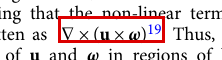

**例子。** #71，`s41598-020-70551-8`，第 6 页。图注末尾的 `3.2.2` 和句号是正文（灰框）。旧标注，按新裁定应为正文（上标 `45`）。

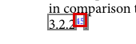

### 表格里的显著性星号和纯数字标正文

**看到什么。** 表格格子里是一个小数，后面跟着显著性星号，没有变量、运算符或括号。例如 `0.046**`。

**怎么标。** 整格按 `2` 标正文。星号不标成公式，纯数字也不标成公式。

**为什么。** 判定：表脚下的 `*` 是正文。2026-09-30 把格子里的显著性星号，以及不带数学符号的纯数字，也定为正文。

**例子。** #78，`pone-0215032`，第 8 页。`0.046` 和显著性星号 `**` 在同一个红框里。旧标注，按新裁定应为正文。

### 写在句子里的公式按行内

**看到什么。** 公式写在句子里面。它可能落在段落最后一行，看起来独占了一行，后面跟着句号。

**怎么标。** 公式按 `i`。句号如果是单独的句子标点，按 `2` 留在正文，不要并进公式。

**为什么。** 经验：写在句子里面的公式是行内式，按 `i`。标点：行内公式后面的句号是句子的标点，保持正文。2026-09-30 写明：即使在段落最后一行，仍按 `i`。

**例子。** #18，`pone-0215032`，第 8 页。`SVX_I` 是公式，句末的 `.` 是正文（灰框）。旧标注，按新裁定应为行内。

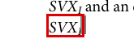

句号粘在不含单词的短数学元素上时，跟进来的句号可以留下。那是另一条，见下面 #40，不要和这里的单独句号混用。

### 表格格子里用逗号隔开的两段式子

**看到什么。** 一个格子里有两段式子，中间用逗号隔开。图上是 `x, y ∈ [−10, 10]`（下标 `n=256`）和 `t ∈ [0, 10]`（下标 `n=20`）。区间两端是方括号，区间内部还有逗号。

**怎么标。** 两段拆成两个单元：框住其中一段，按 `s`。中间那个逗号按 `2` 标正文。方括号和区间内部的逗号留在各自的公式里。

**为什么。** 判定：写在表格格子里、用逗号隔开的内容不要整格一个单元；框住其中一段再按 `s`。标点：区间 `[0, T]` 这种括号属于数学，标成公式；没有外层括号、用来隔开独立内容的逗号是正文。2026-09-30 写明：格子里的两段式子拆开，中间逗号标正文。

**例子。** #85，`s41467-021-26434-1`，第 4 页。两段式子在同一个红框里。旧标注，按新裁定应为两个单元，中间逗号标正文。

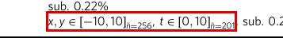

### 图注里的 κ = − 1 是行内公式

**看到什么。** 图注里有 `κ = − 1`。旁边是 `q-values` 里的斜体 `q`，以及面板号 `d`。

**怎么标。** `κ = − 1` 是公式，按 `i` 标成一个行内单元。斜体 `q` 和面板号 `d` 按 `2` 标正文。

**为什么。** 这是 2026-09-30 的正式裁定。`κ = − 1` 在当公式用。`q-values` 里的 `q` 是单词的一部分，不是单独的数学符号；面板号 `d` 也不是公式。先前说的「保留为正文」指 `q` 和 `d`，不是 `κ`。经验里「句子里的单个斜体变量标行内」不覆盖这种 `q`。

**例子。** #176，`s41598-023-28973-7`，第 9 页。复核稿里 `κ = − 1` 是一个行内公式单元。`q` 和面板号 `d` 是正文（灰框）。

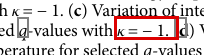

## 复核判定标准

### 行间公式的全部行，连同行末编号

**看到什么。** 居中的一整条式子，右侧有 `(1)` 这种编号。分数线、根号、括号都在这条式子里。

**怎么标。** 整条连同右侧编号框成一个单元，按 `d`。不要把左半和右半拆开，也不要先一层一层合并。

**为什么。** 判定：行间公式的全部行（分数线、根号）算进同一个单元；行末单独的 `(1)`、`(2.3)` 并进旁边那个行间单元。经验：一整条公式是一个单元，编号是它的成员。

**例子。** #1，`1706.03762`，第 4 页。`Attention(Q,K,V)=softmax(QKᵀ/√d_k)V` 连同右侧 `(1)`。

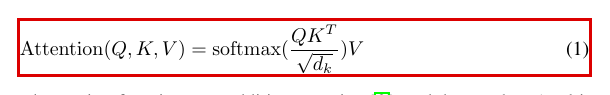

**例子。** #61，`1706.03762`，第 5 页。`FFN(x) = max(0, xW₁ + b₁)W₂ + b₂` 连同 `(2)`。括号、运算符和它们包住的式子中间没有正文，放在同一个单元里。

### 行间公式末尾的句号属于这个单元

**看到什么。** 行间式同一行的末尾有句号，右侧还有编号。

**怎么标。** 句号和编号都留在这个行间单元里。框住公式和句号再按 `m`，整条按 `d`。

**为什么。** 判定：行间公式同一行末尾的逗号或句号属于这个行间单元，导出的公式图会带上它。行末编号并进旁边的行间单元。

**例子。** #93，`jhep04-2021-102`，第 12 页。`W_incl(…) ≡ (…)W_μν(…).` 连同句号和 `(2.22)`。

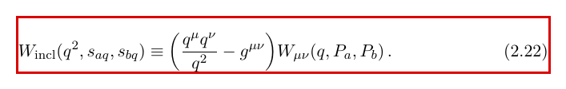

### 数学扩展字体的大括号和它下面的墨迹

**看到什么。** 行间式里有 CMEX 大括号。字形框记在墨迹上方，看得见的墨迹是另一个空字符元素。右侧有编号。

**怎么标。** 字形框和下面的墨迹都留在这个行间单元里，连同编号，按 `d`。复核工具把这一对画成一个框。按 Enter 时，如果当前单元里只有其中一块，会把另一块补进同一个单元。

**为什么。** 经验：数学扩展字体里的大括号会显示成字形框加上它下面的墨迹，这些块都是公式成员。判定：行间公式的全部行是一个单元，行末编号并进去。

**例子。** #101，`s41598-020-70551-8`，第 10 页。式子连同 `(7)`。

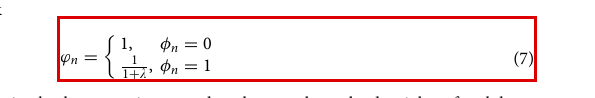

### 基字母和上下标是一个单元

**看到什么。** 一个字母带着上标或下标。上标里可以有逗号，例如 `H^{m,p}`。下标可以是正文字体的短字，例如 `E_gh`、`E_hb`。

**怎么标。** 基字母和上下标整组一个单元。写在句子里就按 `i`。上标里的逗号留在公式里，不要按 `2` 拆出去。

**为什么。** 判定：基字母和它的上下标是一个单元，`E_hb` 整段一个单元。标点：公式内部的逗号，用在下标之间的，是公式，例如 `H^{m,p}`。经验：公式里的文字下标跟着基字母，整式框选按 `m`。

**例子。** #12，`pone-0125679`，第 9 页。`H^{m,p}(Ω` 整组一个行内单元。右括号若粘在后面的正文里，留在正文。

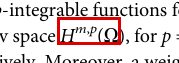

**例子。** #77，`s41598-021-85174-w`，第 9 页。`1 − E_gh E_hb` 一个行内单元，文字下标 `gh`、`hb` 跟着基字母。

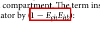

### 不要把左半和右半拆开

**看到什么。** 同一行、同一栏里，一条式子的左右两半隔着一段空白。中间没有正文单词。

**怎么标。** 两半合成一个行间单元。框住整行按 `m`，再按 `d`。

**为什么。** 判定：不要把左半和右半拆开。经验：单栏里两半式子隔着空白也要合。一行只能有一个单元。

**例子。** #183，`jhep04-2021-102`，第 18 页。`W₂ = −2(W₊₋ + W₋₊)` 和隔着空白的 `= 2(…)W^μν,`。

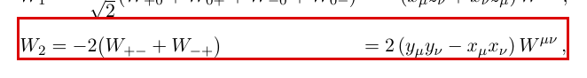

### 元组是一个行内单元

**看到什么。** 括号里写成的元组，例如 `(u_0i, u_1i)`。两侧括号粘在 `effects (`、`). The` 这种带单词的正文里。

**怎么标。** 两个符号和中间逗号是一个行内单元，按 `i`。粘在正文里的括号留在正文，按 `2` 的那段不要并进来。单元里没有这对括号，也算对。

**为什么。** 判定：括号里的元组或向量是一个行内单元；符号、下标和中间的逗号都属于这一个单元。括号如果已经嵌在更宽的正文里，这段正文保持正文。标点：括号或标点粘在更宽的正文块里，这块正文里还有普通单词，正文保持正文。经验：粘在正文块里的括号不能单独选中，把这段正文留成正文，算对。这是工具的已知限制。

**例子。** #5，`bmc-12874-022-01542-8`，第 2 页。

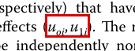

### 没有外层括号时，每个符号自己一个单元

**看到什么。** 正文里用逗号隔开一串符号，外面没有括号包住整串。例如 `q_x, q_y`。

**怎么标。** 每个符号自己一个行内单元，按 `i`。中间逗号按 `2` 标正文。如果它们还在同一个单元里，框住其中一个再按 `s`。

**为什么。** 判定：写在正文里、用逗号隔开的一串数学符号，每个符号单独是一个行内单元。每个符号单独成一个单元，只用于没有外层括号的一串。标点：没有外层括号、用来隔开一串独立符号的逗号是正文。

**例子。** #20，`s41598-022-19656-w`，第 2 页。两个红框是 `q_x` 和 `q_y`，中间逗号是灰框（正文）。

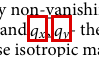

格子里用逗号隔开的两段式子，见上面 #85。那是两段式子，不是一串单个符号。

### 作者单位上标是正文

**看到什么。** 作者名旁边的单位上标，例如 `Qi` 右上角的 `1`，后面还有逗号。

**怎么标。** 作者名、上标和逗号全部按 `2` 标正文。这里没有公式单元。

**为什么。** 判定：作者单位上标 `1`、`2` 按 `2`。

**例子。** #11，`s41598-020-70551-8`，第 1 页。灰框是正文。

### 整行正文改回正文

**看到什么。** 整行句子被标成了公式。句子里夹着真正的数学，其余是普通单词。括号或标点粘在带单词的正文块里。

**怎么标。** 整行正文按 `2`。公式单元只留下数学。粘在正文里的括号留在正文。

**为什么。** 判定：整行正文被标成公式时，按 `2`。标点：括号粘在更宽的正文块里，这段正文保持正文。经验：粘在正文块里的括号不能单独选中，留成正文算对。

**例子。** #186，`1410.3394`，第 8 页。`Note that for a given ∆, several` 和 `∆) can be computed …` 改成正文（灰框）。公式单元只剩 `m(q,`。

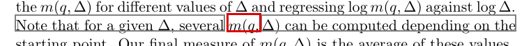

### 正文字体的数字加单位是正文

**看到什么。** 正文字体写出的数量加单位，例如表格里的 `1.0 μF/cm²`，或正文里的 `304 × 213 × 84 mm³`。

**怎么标。** 全部按 `2` 标正文。没有公式单元。

**为什么。** 判定：带单位的量（例如 `50 μm`）按 `2`。经验：正文字体的数字加单位是正文。

**例子。** #34，`pcbi-1004584`，第 10 页。表格里的 `1.0 μF/cm²` 是灰框（正文）。

**例子。** #221，`s41598-020-70551-8`，第 11 页。`304 × 213 × 84 mm³` 全是灰框（正文）。

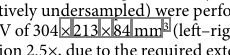

排成数学的单位是公式，见下面 #22。不带单位、也不带数学符号的纯数字，见上面 #78。

### 插图里的刻度标成其他

**看到什么。** 插图坐标轴上的刻度数字，例如 `0`、`10`。

**怎么标。** 按 `4` 标其他。

**为什么。** 判定：插图里的坐标、刻度按 `4`。

**例子。** #159，`s41467-019-10988-2`，第 6 页。灰框是其他。

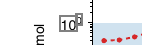

### 句子里的单个斜体变量

**看到什么。** 句子里单独一个斜体字母，正在当数学符号用。后面的句号是另一个字形。

**怎么标。** 这个字母按 `i`。后面的句号按 `2`，不要并进公式。

**为什么。** 判定：行内单个变量，如果在当数学符号用，标成行内公式。行内公式后面的句号是句子的标点，保持正文。经验：句子里的 `x`、`t`、`q` 这类单个斜体变量，标成行内公式。普通英文单词不要标成公式。

**例子。** #49，`s41467-019-09785-8`，第 2 页。`θ` 是红框，后面的 `.` 是灰框（正文）。

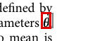

段落最后一行的句子公式，见上面 #18。图注里 `q-values` 的斜体 `q` 不是这种变量，见「2026-09-30 新裁定」的 #176。

## 标点和括号怎么标

### 标点粘在不含单词的短数学元素上

**看到什么。** 逗号、冒号、句号或括号和数学字符粘在同一个短元素里，这段里没有普通单词。例如 `0:`、`0,`，或末尾的 `).`。

**怎么标。** 把这个短元素并进公式单元，按 `m`。跟着进来的标点可以留下。行内的整段按 `i`。

**为什么。** 标点：标点粘在数学字符上，合在一个没有普通单词的短元素里，标成公式。去掉它会丢掉那个数学字符。这和标点粘在带普通单词的正文里相反。

**例子。** #36，`1410.3394`，第 3 页。`, ∆`、`0,`、`0:` 都并进公式。整段 `t ∈ ℝ, Δ ≥ 0, q > 0:` 是一个行内单元。

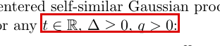

**例子。** #40，`pcbi-1005421`，第 8 页。`η(T_D) = 1 − σ(T_D).` 的末尾 `).` 不含单词。右括号是数学，整块并进行内单元，跟进来的句号可以留下。

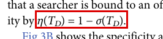

图注里的 #176 见「2026-09-30 新裁定」：`κ = − 1` 是行内公式，斜体 `q` 和面板号 `d` 是正文。「保留为正文」只指 `q` 和 `d`。

### 属于名称的括号留在正文

**看到什么。** 名称带着括号，括号里才是数学。例如表头 `ADAPT(ε₃)`。

**怎么标。** 只框里面的数学。单元只有 `ε` 和 `3`。`ADAPT(` 和 `)` 是正文。`)` 按 `2`，不要按 `m` 并进公式。

**为什么。** 标点：属于名称或正文的括号标成正文，只框里面的数学。经验：`ADAPT(ε₃)` 的单元只有 `ε` 和 `3`，`)` 是正文。表头里也一样。

**例子。** #39，`s41467-019-10988-2`，第 7 页。`)` 是灰框（正文）。

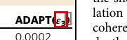

### 引用括号和正文字体的单位上标是正文

**看到什么。** 正文字体单位的上标，例如 `cm⁻²` 的 `⁻²`，旁边还有引用括号 `[2].`。

**怎么标。** 上标和引用括号都按 `2` 标正文。这里没有公式单元。

**为什么。** 标点：引用括号 `[12]` 是正文。经验：正文字体的数字加单位是正文。判定：带单位的量按 `2`。

**例子。** #238，`pcbi-1009231`，第 7 页。灰框是正文。

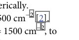

公式后面的引用上标（没有方括号的那种）见上面 #165、#71。

### 排成数学的单位是公式

**看到什么。** 单位用数学字体排，带数学括号和斜线，例如 `(cells/mm²)`。

**怎么标。** 整个是一个行内公式单元，按 `i`。

**为什么。** 经验：排成数学的单位是公式，例如带数学字体括号、斜线、分数或上标的 `(cells/mm^2)`。这和正文字体的 `50 μm` 相反。

**例子。** #22，`pcbi-1008462`，第 3 页。

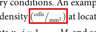

## 复核经验总结

### 正文字体里的函数名和算子名

**看到什么。** `sin`、`ppcm` 这类名字用正文字体排，预标注把它标成了正文。它是式子的一部分。后面可以有括号，也可以没有。

**怎么标。** 用 `m` 并进公式。行间的整行按 `d`，行内的按 `i`。行间式同一行末尾的逗号一起框住，留在这个行间单元里。

**为什么。** 经验：`sin`、`max`、`log`、`Cov`、`ppcm` 是公式的一部分。预标注标成正文时，用 `m` 并进，后面有没有括号都一样。标点：行间式那一行末尾的逗号是公式，并进同一个行间单元。右括号如果粘在带单词的正文里，那段正文保持正文。

**例子。** #2，`crmath-64`，第 2 页。正文字体的 `ppcm` 并进公式。整行居中式连同末尾逗号是一个行间单元。

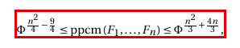

**例子。** #10，`pcbi-1005421`，第 6 页。正文字体的 `sin(` 用 `m` 并进 `p(θ₀) ∼ sin(θ₀` 这个行内单元。右括号粘在后面正文里，留正文。

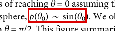

`max`、`log` 是同一条规则。`Tr`、`det`、`diag`、`rank`、`sgn`、`Re`、`Im` 也属于公式，见文末「暂无练习集例子」。`Cov[` 嵌在带单词的正文里时，正文保持正文，同样见文末。

### 同一行并排的两个行间式是一个单元

**看到什么。** 同一行、同一栏里并排两条式子，中间没有正文单词。每条末尾可以有逗号。右侧可以有一个编号，也可以没有。

**怎么标。** 整行一个行间单元，按 `d`。两个逗号都留在这个单元里。框住整行按 `m`。有编号时，只有编号那几个字形按 `e` 标成编号，不要把整行都标成编号。这一轮按行复核：编号写在后面某一行时，不要和下一行合并。

**为什么。** 经验：同一行并排的两个行间式是一个行间单元，两个式子末尾的逗号都留在这个单元里。单独占一行、居中排的公式，有没有编号都按 `d`。编号写在后面某一行时，每一行自己是一个行间单元。标点：同一行两个式子各有一个逗号时，两个逗号都留在这一个行间单元里。

**例子。** #33，`jhep04-2021-102`，第 9 页。`P_a^μ = …,` 和 `P_b^μ = …,` 连同两个逗号和 `(2.8)` 是一个行间单元。只有 `(2.8)` 标成编号。

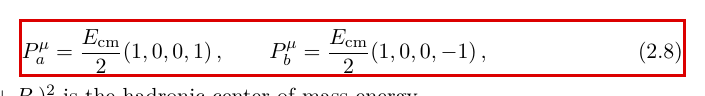

**例子。** #80，`s41598-022-19656-w`，第 3 页。`σ′xx = σxx + γθ,  σ′yy = σyy + γθ,` 两式和两个逗号是一个行间单元。这一行自己没有编号，也按 `d`。不和下一行带 `(13)` 的式子合并。

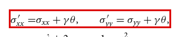

**例子。** #110，`s41598-022-19656-w`，第 4 页。同一行的 `A = (…), B = (…),` 框住整行按 `m`，是一个行间单元。

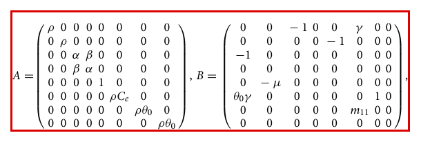

### 折成两行的长式是一个行间单元

**看到什么。** 同一条式子太长，折成两行。第二行以运算符开头，或者一对括号的左半在上一行、右半在下一行。编号可以排在两行中间。

**怎么标。** 两行加上编号是一个行间单元，按 `m` 再按 `d`。不要拆成两行两个单元。

**为什么。** 经验：折成两行的长式整条算一个行间单元，编号在哪一行都算它的成员。判断办法是第二行以 `+`、`=`、`-` 开头，或者一对括号分在两行。拆开会把一对括号分到两个单元里。两行若是两条独立的式子，仍然一行一个单元。

**例子。** #15，`s41467-020-19530-1`，第 2 页。式 (4) 的大方括号 `[` 在第一行、`]` 在第二行，两行加 `(4)` 是一个行间单元。

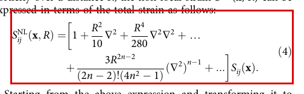

**例子。** #197，`s41598-021-85174-w`，第 9 页。式 (18) 的第二行以 `+` 开头，`(18)` 排在两行中间。

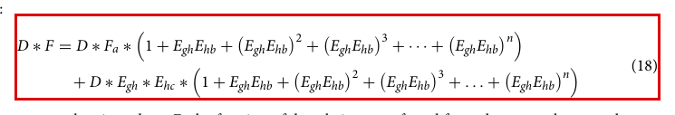

### 带行末编号的居中式按行间

**看到什么。** 式子居中，行末有编号。编号右边或另一栏的同一条基线上还有英文单词。

**怎么标。** 带编号的这一个单元按 `d`。旁边的单词不改成公式，也不用来把这条改成行内。

**为什么。** 经验：单独占一行、居中排的公式按 `d`。行末编号在，旁边的句子不否定它。

**例子。** #69，`s41467-019-10988-2`，第 3 页。带 `(2)` 的居中式按 `d`。右栏句子和它同一条基线，不否定行末编号。

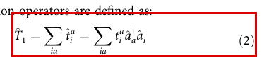

**例子。** #147，`s42005-024-01697-4`，第 8 页。带 `(54)` 的居中式按 `d`。编号右边紧跟的 “where all” 不否定行末编号。

提示/边界：这张图里编号在行间单元中，但没有标成编号。这里只作提示，不下新规则。判定要求的是编号并进旁边的行间单元。

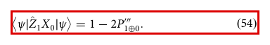

### 每行各带编号的连等式，一行一个单元

**看到什么。** 连等式里这一行以 `=` 开头，行末有自己的编号。

**怎么标。** 这一行自己是一个行间单元，按 `d`。不和上一行合并。

**为什么。** 经验：每一行各带自己编号的连等式（每行以 `=` 或 `≡` 开头，行末各有编号）算独立的式子，一行一个单元。两行是两条独立的式子时，仍然一行一个单元。

**例子。** #178，`pcbi-1009231`，第 3 页。以 `=` 开头、行末带 `(3)` 的这一行。判定文档里 #277 是同一条，本案例集没有那张图。

提示/边界：这张图里编号在行间单元中，但没有标成编号。这里只作提示，不下新规则。

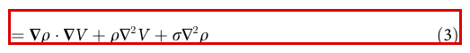

### 等式左边单独一行，并进带编号的单元

**看到什么。** 等式左边单独占一行，下面几行以 `≡` 或 `×` 接下去，编号在最后一行。

**怎么标。** 左边这一行并进紧接着的那个带编号的单元。三行加上编号是一个行间单元，按 `m` 再按 `d`。下面另一条带自己编号的 `≡` 行另成一个单元。

**为什么。** 经验：等式左边单独占一行、下一行以 `=` 或 `≡` 开头时，左边这一行并进紧接着的那个带编号的单元。

**例子。** #123，`jhep04-2021-102`，第 12 页。`[BaBbS](Q², …)`、`≡ ∫ …`、`× Ba … S(…)` 三行加 `(2.24a)` 是一个行间单元。

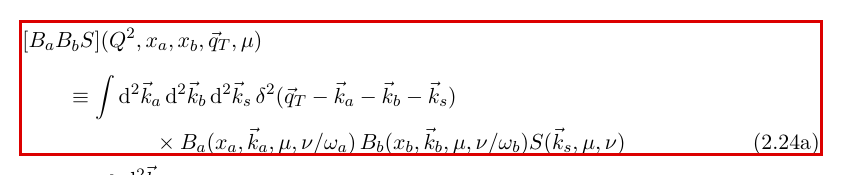

### 公式里的文字下标，以及根号横线的乱码

**看到什么。** 行间式里有根号。根号上的横线被抽成 `ffiffiffi` 这种 ffi 乱码。下标是正文字体的单词，例如 `∏_sites` 的 `sites`。

**怎么标。** 乱码和下标都属于这个行间单元。整式框住按 `m`，再按 `d`。

**为什么。** 经验：数学符号字体里的乱码（根号横线、大括号等）属于公式。根号横线有时被抽成 `ffiffiffi`，把整式框住再按 `m` 即可。公式里的文字下标（`∏_sites`、`H_vac` 等）属于公式。

**例子。** #117，`s42005-024-01697-4`，第 5 页。

提示/边界：这张图的式子接到下一行。现有的折行例外只写了两种：第二行以运算符开头，或一对括号分在两行。这里只作提示，不下新规则。根号横线和 `sites` 仍按上面两条属于这个行间单元。

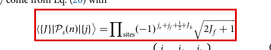

`H_vac` 这种文字下标是同一条。短的文字下标见上面 #77。

### 分子上的数学斜体短串

**看到什么。** 分数的分子是数学斜体的短串，例如 `ia/2` 的分子 `ia`（i 乘 a）。它看起来像两个字母。

**怎么标。** 分子属于公式。整行框住按 `m`，行间式按 `d`。

**为什么。** 经验：分数上的数学斜体短串属于公式，例如 `ia/2` 的分子 `ia`。

**例子。** #177，`s42005-024-01697-4`，第 8 页。整行 `U(…) = I + ia/2 (…)` 是一个行间单元。

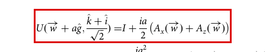

### 不同句子里两个不相干的式子

**看到什么。** 同一块裁剪里有两个式子，它们出现在不同句子里，彼此不是一条式子的两半。

**怎么标。** 各自一个行内单元，按 `i`。不要按 `m` 合成一个。

**为什么。** 经验：出现在不同句子里的两个不相干的式子，各自是一个单元。判定的反例包括两个不相干的式子并成一个单元。

**例子。** #133，`s41467-018-07210-0`，第 4 页。`y = φ(x)` 和 `φ: ℝⁿ → ℝᵖ` 是两个红框。

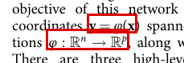

### 后面的队列条目已经并进前面的单元

**看到什么。** 轮到后面的队列条目时，红框已经是前面那条合并后的整行，包括编号。式子里的下标或上下限可能曾经被拆出去。

**怎么标。** 红框就是合并后的那个单元。核对一下再按 Enter。下标和上下限若被拆出，把整行选中再按 `m` 合回，行间按 `d`。

**为什么。** 经验：后面队列里的一条可能已经并进前面的单元。轮到它时，红框是合并后的那个单元。操作：只选中一部分再按 `s`，没选中的会变成另一个单元；把整行选中再按 `m` 就能合回去。

**例子。** #127，`2006.11239`，第 2 页。公式 (3) 整行连同 `(3)` 是一个行间单元。#127 已并进这个单元，主条目是 #37。

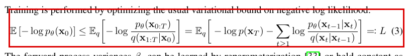

## 暂无练习集例子

下面这些情况，三节里有规则，附件的图里没有 #1–#277 的例子。

### 脚注号

**看到什么。** 页边上的小数字，例如 `4`、`16`。复核集打开后，第一条有时就是这种脚注号。

**怎么标。** 按 `2` 改成正文，再按 Enter。

**为什么。** 判定：脚注号不是公式。

**例子。** 暂无练习集例子。

### 节标题

**看到什么。** 节标题，例如 `B.2`。

**怎么标。** 按 `2` 标正文。

**为什么。** 判定：节标题不是公式。反例是节标题被标成行间公式。

**例子。** 暂无练习集例子。

### 图注里的整句

**看到什么。** 图注里的一整句说明被标成了公式。

**怎么标。** 按 `2` 标正文。

**为什么。** 判定：图注里的整句按 `2`。

**例子。** 暂无练习集例子。图注里的引用上标见 #71，图注里的公式和面板号见 #176。那两张不是整句改正文。

### 脚注符号和表脚下的字母

**看到什么。** 脚注符号 ☯。表脚下单独的 `a`、`b`、`*`，后面跟着说明文字。

**怎么标。** 按 `2` 标正文。

**为什么。** 判定：脚注符号 ☯，表脚下的 `a`、`b`、`*`，按 `2`。

**例子。** 暂无练习集例子。格子里面的显著性星号和纯数字是另一条，见 #78。

### 插图里的矢量路径

**看到什么。** 插图里的矢量路径。

**怎么标。** 按 `4` 标其他。

**为什么。** 判定：插图里的矢量路径按 `4`。

**例子。** 暂无练习集例子。刻度数字见 #159。

### 表格线

**看到什么。** 表格的横线或竖线。

**怎么标。** 按 `4` 标其他。

**为什么。** 判定：表格线按 `4`。

**例子。** 暂无练习集例子。

### 图注和正文之间的分隔线

**看到什么。** 图注和正文之间的分隔线。

**怎么标。** 按 `4` 标其他。

**为什么。** 判定：图注和正文之间的分隔线按 `4`。

**例子。** 暂无练习集例子。

### 表格里的引用括号

**看到什么。** 表格格子里的引用，例如 `[23]`。

**怎么标。** 按 `2` 标正文。

**为什么。** 判定：表格里的 `[23]` 不是公式。标点：引用括号 `[12]` 是正文。

**例子。** 暂无练习集例子。正文里的 `[2]` 见 #238。那张不在表格里。

### 嵌在正文里的 Cov[

**看到什么。** `Cov[` 嵌在带普通单词的正文里，例如 `Indeed, Cov[`。

**怎么标。** 这段正文保持正文，不要按 `m` 把 `Cov[` 并进公式。只框里面的数学。

**为什么。** 标点：属于名称或正文的括号，落在带普通单词的正文块里时，这段正文保持正文。经验：`Cov[` 如果嵌在带普通单词的正文里，这段正文保持正文。

**例子。** 暂无练习集例子。名称括号的对照图是 #39。

### 迹算子和同类算子名

**看到什么。** 正文字体的迹算子 `Tr`，以及 `det`、`diag`、`rank`、`sgn`、`Re`、`Im`。

**怎么标。** 整式框住按 `m`，并进公式。

**为什么。** 经验：这些算子名属于公式，和文字下标一样。

**例子。** 暂无练习集例子。正文字体函数名的对照图是 #2（`ppcm`）和 #10（`sin`）。

### 不在队列里的灰色框

**看到什么。** 同一页上还有灰色细框，不在当前这条队列里。例如 `s41467-019-10988-2` 第 7 页的 `ADAPT(ε₁)`、`ADAPT(ε₂)`。

**怎么标。** 可以不改。为了前后一致去改，也没有害处。只核对红色实心的当前单元。

**为什么。** 经验：灰色细框是其他预标注，不用管。同一页上不在队列里的灰色框可以不改。

**例子。** 暂无练习集例子。同一页表头 `ADAPT(ε₃)` 的标法见 #39。后面的队列条目已经并进前面单元的，见 #127。

## 图索引

| 文件 | #N | 论文 | 页 | 所在节 |
| --- | --- | --- | --- | --- |
| `1-attention-eq1-display-number.png` | #1 | 1706.03762 | 4 | 行间公式的全部行，连同行末编号 |
| `2-ppcm-body-font-operator-name.png` | #2 | crmath-64 | 2 | 正文字体里的函数名和算子名 |
| `5-tuple-parens-glued-in-text.png` | #5 | bmc-12874-022-01542-8 | 2 | 元组是一个行内单元 |
| `10-body-font-sin-merged.png` | #10 | pcbi-1005421 | 6 | 正文字体里的函数名和算子名 |
| `11-author-affiliation-superscript-text.png` | #11 | s41598-020-70551-8 | 1 | 作者单位上标是正文 |
| `12-hmp-superscript-comma.png` | #12 | pone-0125679 | 9 | 基字母和上下标是一个单元 |
| `15-two-line-bracket-eq4.png` | #15 | s41467-020-19530-1 | 2 | 折成两行的长式是一个行间单元 |
| `18-inline-trailing-period-doubt.png` | #18 | pone-0215032 | 8 | 写在句子里的公式按行内 |
| `20-comma-list-each-symbol.png` | #20 | s41598-022-19656-w | 2 | 没有外层括号时，每个符号自己一个单元 |
| `22-math-typeset-unit.png` | #22 | pcbi-1008462 | 3 | 排成数学的单位是公式 |
| `33-side-by-side-eqs-one-unit.png` | #33 | jhep04-2021-102 | 9 | 同一行并排的两个行间式是一个单元 |
| `34-body-font-number-unit-text.png` | #34 | pcbi-1004584 | 10 | 正文字体的数字加单位是正文 |
| `36-punct-glued-short-math.png` | #36 | 1410.3394 | 3 | 标点粘在不含单词的短数学元素上 |
| `39-adapt-eps3-header.png` | #39 | s41467-019-10988-2 | 7 | 属于名称的括号留在正文 |
| `40-inline-paren-period-glued.png` | #40 | pcbi-1005421 | 8 | 标点粘在不含单词的短数学元素上 |
| `49-single-italic-variable.png` | #49 | s41467-019-09785-8 | 2 | 句子里的单个斜体变量 |
| `61-parens-operators-one-unit.png` | #61 | 1706.03762 | 5 | 行间公式的全部行，连同行末编号 |
| `69-display-number-right-column-words.png` | #69 | s41467-019-10988-2 | 3 | 带行末编号的居中式按行间 |
| `71-caption-citation-superscript-doubt.png` | #71 | s41598-020-70551-8 | 6 | 引用上标标正文 |
| `77-base-with-text-subscript.png` | #77 | s41598-021-85174-w | 9 | 基字母和上下标是一个单元 |
| `78-table-cell-stars-doubt.png` | #78 | pone-0215032 | 8 | 表格里的显著性星号和纯数字标正文 |
| `80-sigma-pair-one-display-unit.png` | #80 | s41598-022-19656-w | 3 | 同一行并排的两个行间式是一个单元 |
| `85-table-cell-interval-doubt.png` | #85 | s41467-021-26434-1 | 4 | 表格格子里用逗号隔开的两段式子 |
| `93-display-trailing-period-number.png` | #93 | jhep04-2021-102 | 12 | 行间公式末尾的句号属于这个单元 |
| `101-cmex-brace-empty-box.png` | #101 | s41598-020-70551-8 | 10 | 数学扩展字体的大括号和它下面的墨迹 |
| `110-matrices-one-row-unit.png` | #110 | s41598-022-19656-w | 4 | 同一行并排的两个行间式是一个单元 |
| `117-sqrt-ffi-sites-subscript.png` | #117 | s42005-024-01697-4 | 5 | 公式里的文字下标，以及根号横线的乱码 |
| `123-lhs-line-merged-into-numbered.png` | #123 | jhep04-2021-102 | 12 | 等式左边单独一行，并进带编号的单元 |
| `127-ddpm-eq3-merged-unit.png` | #127 | 2006.11239 | 2 | 后面的队列条目已经并进前面的单元 |
| `133-two-unrelated-inline-units.png` | #133 | s41467-018-07210-0 | 4 | 不同句子里两个不相干的式子 |
| `147-display-number-followed-by-words.png` | #147 | s42005-024-01697-4 | 8 | 带行末编号的居中式按行间 |
| `159-figure-ticks-other.png` | #159 | s41467-019-10988-2 | 6 | 插图里的刻度标成其他 |
| `165-citation-superscript-merged-doubt.png` | #165 | s41467-020-19530-1 | 5 | 引用上标标正文 |
| `176-caption-kappa-glued-paren-q-text.png` | #176 | s41598-023-28973-7 | 9 | 图注里的 κ = − 1 是行内公式 |
| `177-ia-over-2-numerator.png` | #177 | s42005-024-01697-4 | 8 | 分子上的数学斜体短串 |
| `178-chained-equals-own-number.png` | #178 | pcbi-1009231 | 3 | 每行各带编号的连等式，一行一个单元 |
| `183-left-right-halves-merged.png` | #183 | jhep04-2021-102 | 18 | 不要把左半和右半拆开 |
| `186-text-lines-ruled-text.png` | #186 | 1410.3394 | 8 | 整行正文改回正文 |
| `197-eq18-wrapped-two-lines.png` | #197 | s41598-021-85174-w | 9 | 折成两行的长式是一个行间单元 |
| `221-quantity-with-unit-text.png` | #221 | s41598-020-70551-8 | 11 | 正文字体的数字加单位是正文 |
| `238-unit-superscript-citation-bracket-text.png` | #238 | pcbi-1009231 | 7 | 引用括号和正文字体的单位上标是正文 |
